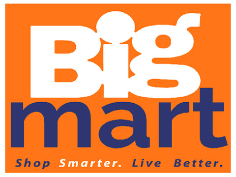

# Bigmart-Product-Sales-Prediction
> Readme file for the BigMart product sales prediction machine learning project

Predict the impact of other factors on sales of a particular product in a particular Big mart store. Through the analysis, I am planning to predict the impact of other factors on sales of a particular product in a particular store. The train file will be used to explore the data and train the model. The model will be applied on test data in the test file and model performance will be evaluated.

# Table of contents

- [Getting Started](#getting-started)
  - [Prerequisite](#prerequisite)
  - [Installation](#installation)
- [Usage](#usage)
- [Project Status](#project-status)
- [Versioning](#versioning)
- [Authors](#authors)
- [Acknowledgements](#acknowledgements)

## Getting Started
[(Back to top)](#table-of-contents)
These instructions will get you a copy of the project up and running on your local machine for development and testing purposes. See deployment for notes on how to deploy the project on a live system.

### Prerequisite
[(Back to top)](#table-of-contents)
To execute this project, you will need the following applications - 
* Pythnon 3 (or Anaconda distribution with Python 3)
* Jupyter or any other notebook

Anaconda distribution alone should be enough. Find it [here](https://www.anaconda.com/distribution/)

### Installation
[(Back to top)](#table-of-contents)
This particular project does not require any installation other than the required softwares mentioned above.

## Usage
[(Back to top)](#table-of-contents)
This section will be updated as the project is developed.

## Project Status
[(Back to top)](#table-of-contents)
* Business Qustion - done
* Data Acquisition - done
* EDA - done
* Data Cleansing - done
* Feature Engineering - done
* Model Building - done
* Model evaluation - done
* Presentation and paper writing - done

## Versioning
[(Back to top)](#table-of-contents)
Git is used for project versioning.

## Authors
[(Back to top)](#table-of-contents)
_Anirban Pal_

## Acknowledgements
[(Back to top)](#table-of-contents)
1.	Gaggin, Alex, _Applying machine learning to sales prediction_
The article, published in R Studio, gives a detailed idea of how previous sales data can be used to predict future sales. It uses R programing language and gives an overview of the exploration and model building process.
2.	Dancho, Matt (2017), _Predictive Sales Analytics: Use Machine Learning to Predict and Optimize Product Backorders_
In this article, the author covers the challenge of dataset imbalance, i.e. when the majority class significantly outweighs the minority class. He created backorder prediction model through example. 
3.	Mitra, Rudradeb (2019), _How-to-Use Machine Learning for Buying Behavior Prediction: A Case Study on Sales Prospecting_
In this article from Medium, the author used machine learning algorithms (Neural Networks) to identify sales prospects. He described an end to end sales process and pipeline.
4.	Jain, Asrshay (2016), _Approach and Solution to break in Top 20 of Big Mart Sales prediction_
In this article, the author gave an extensive overview of the top 20 Big Mart sales prediction models.
5.	Columbus, L (2018),_10 Ways Machine Learning Is Revolutionizing Sales_
In this article, author gave statistics of to what degree companies are adopting AI to predict sales. He also cited some of the use cases of AI and machine learning in sales and marketing.
6.	_A Machine Learning Approach to Inventory Demand Forecasting_
This article from [gormanalysis.com](gormanalysis.com) deals with Inventory Demand Forecasting, - effect of overstocking and understocking.
7.	Javier (2018), _How Machine Learning is reshaping Price Optimization_
In this article, the author describes what price optimization is and how machine learning could be used in price optimization. For explanation, he used a typical scenario of a brick-and-mortar retailer. He also described the advantages of price optimization using machine learning.
8.	Book, Adrien (2018), _Machine Learning & Physical Retail: A Love Story Waiting to Happen?_
In this article author described the concept of forecasting, personalization, stock visibility in retail. He also described cases natural language processing can help in sales. Overall, he has a skeptical tone on the practical application of all these technologies.
9.	Bobriakov, Igor (2018), _Top 10 Data Science Use Cases in Retail_
In this article author described machine learning use cases like Recommendation Engine, Market Basket Analysis, Price Optimization, Store location, Customer Sentiment Analysis etc. and how they can be applied to the retail industry.
10.	Guinn, Justin (2018), _FutureProof Your Small Business: Machine Learning In Retail_
In this article the author presented a nice visual about machine learning. He went on to further explain concepts like Understanding Customer Behavior and Operational Efficiency. He also explained data requirement for machine learning.
